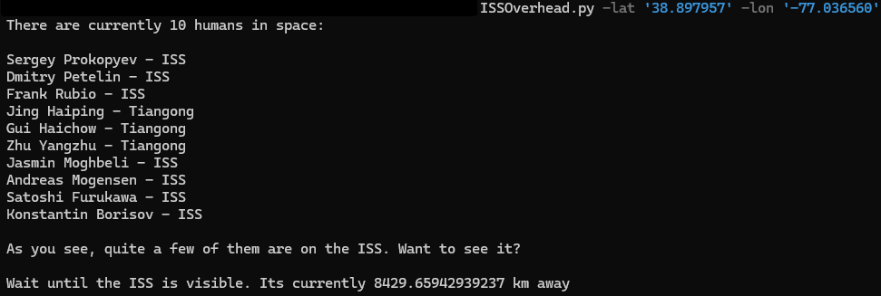

# See the ISS

 A project to notify you when the International Space Station (ISS) is visible from your location.

Run "SeeTheISS.py" in your terminal with your location if you just want to know when its available, or on a Raspberry PI with a LED connected to the GPIO pins (default = 18) if you want a visible notification. 
```
python ISSOverhead.py -lat '38.897957' -lon '-77.036560'
```



Leverages Open-Notifys "ISS-Pass-Times" and "Astros" APIs

http://api.open-notify.org/iss-now.json
http://api.open-notify.org/astros.json